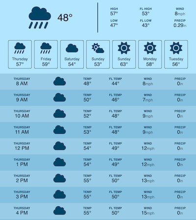

# README

## Description

This are the local files I created while following a tutorial from the YouTube channel [Web Dev Simplified](https://www.youtube.com/@WebDevSimplified):

- [How To Build A Weather App In JavaScript Without Needing A Server](https://www.youtube.com/watch?v=w0VEOghdMpQ)
- [GitHub repository](https://github.com/WebDevSimplified/js-weather-app)

I didn't clone or fork the project repo because I wanted to learn how to create everything from scratch. This was a good experience and I learned some things about Vite, Axios, and Open-Meteo's Free Weather API.

I made some notes for myself while I was following the tutorial.

## Notes

Install create-vite, run initializer, and create package.json: `npm create vite@latest`

Project name: . (current directory)
Framework: Vanilla
Variant: JavaScript

```sh
npm install # install requirements
npm run dev # run locally
```

Install axios: `npm install axios`

[open-meteo.com API URL](https://api.open-meteo.com/v1/forecast?latitude=42&longitude=-71&timezone=America%2FNew_York&daily=weather_code,temperature_2m_max,temperature_2m_min,apparent_temperature_max,apparent_temperature_min,precipitation_sum&hourly=temperature_2m,apparent_temperature,precipitation,weather_code,wind_speed_10m&current=wind_speed_10m,temperature_2m&timeformat=unixtime&wind_speed_unit=mph&temperature_unit=fahrenheit&precipitation_unit=inch)

Remove the `latitude`, `longitude`, and `timeZone` parameters before passing that URL to `axios.get()` in [./src/weather.js](./src/weather.js)

Some of [Open Meteo's API parameters](https://open-meteo.com/en/docs) have changed since Kyle's created the project. His code still works as-is so it must still support the older parameters.

- `current_weather` is now `current`
    - `temperature` is now `temperature_2m`
    - `windspeed` is now `wind_speed_10m`
- `weathercode` is now an array in `daily` called `weather_code`
- `apparent_temperature_2m_max` is now `apparent_temperature_max`
- `apparent_temperature_2m_min` is now `apparent_temperature_min`

I made some minor changes to use CSS variables for the colors.

## Screenshot


